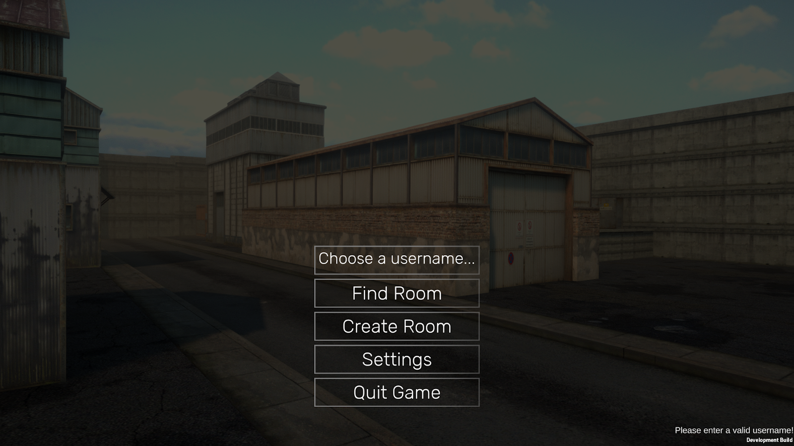
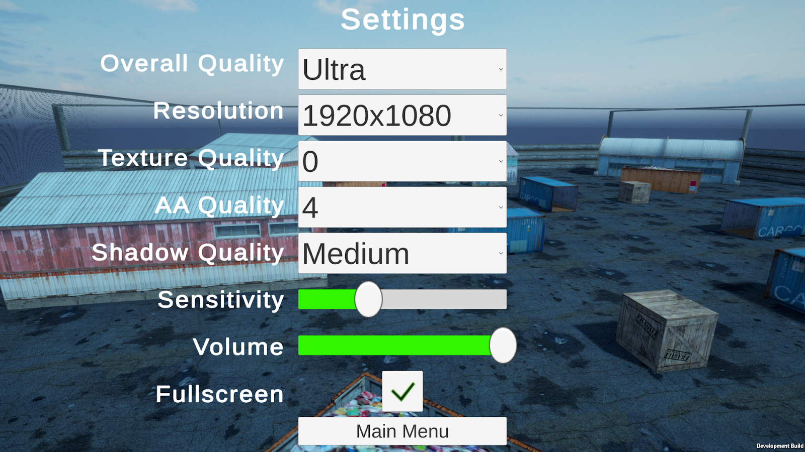
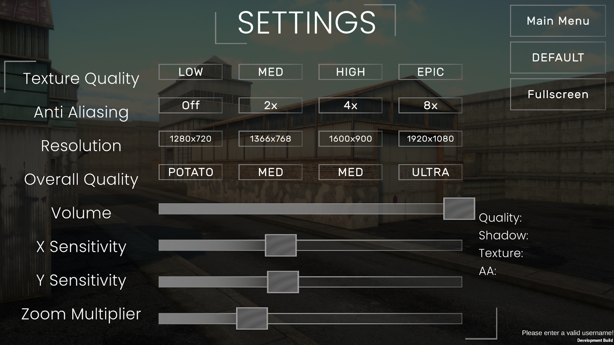
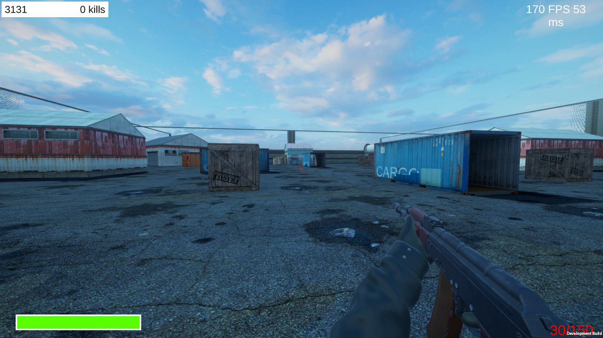

# 🔫 Unity Multiplayer FPS

A multiplayer First-Person Shooter (FPS) developed to explore real-time networking capabilities using **Unity** and **Photon Networking (PUN)**.

This project was built as a technical thesis (Gymnasiearbete) to investigate the challenges of synchronizing game states, handling client-server communication, and optimizing network performance.

## 🎮 Project Overview

The goal was to create a fully functional multiplayer environment where players can host lobbies, join rooms, and battle in a 3D arena. The project focuses heavily on backend networking logic while delivering a smooth gameplay experience with optimized graphics and controls.

### Key Features

- **Real-Time Multiplayer:** Full synchronization of player movement, rotation, and actions using Photon Unity Networking.
- **Lobby System:** Complete menu system allowing users to **Create Rooms**, **Find Rooms**, and manage lobby connections.
- **FPS Mechanics:** Responsive weapon handling, shooting mechanics, and health management.
- **Advanced Settings:** A robust options menu allowing players to tweak:
  - **Graphics:** Resolution, Anti-Aliasing, Shadow Quality, and Texture Quality.
  - **Controls:** Independent X/Y Sensitivity and Zoom Multiplier.
  - **Audio:** Master volume control.
- **Optimization:** Implemented **Object Pooling** for particle effects (like muzzle flashes) and Occlusion Culling to ensure high frame rates.

## 📈 Visual Evolution

The project went through several iterations to improve visual fidelity and UI/UX design. Below is the progression from the early prototype stages to the final build.

|                                        Early Prototype                                        |                                       Final Version                                       |
| :-------------------------------------------------------------------------------------------: | :---------------------------------------------------------------------------------------: |
|  **Main Menu**    |  **Main Menu**    |
| **Settings Menu**  | **Settings Menu**  |
| **Gameplay POV**   | **Gameplay POV**   |
